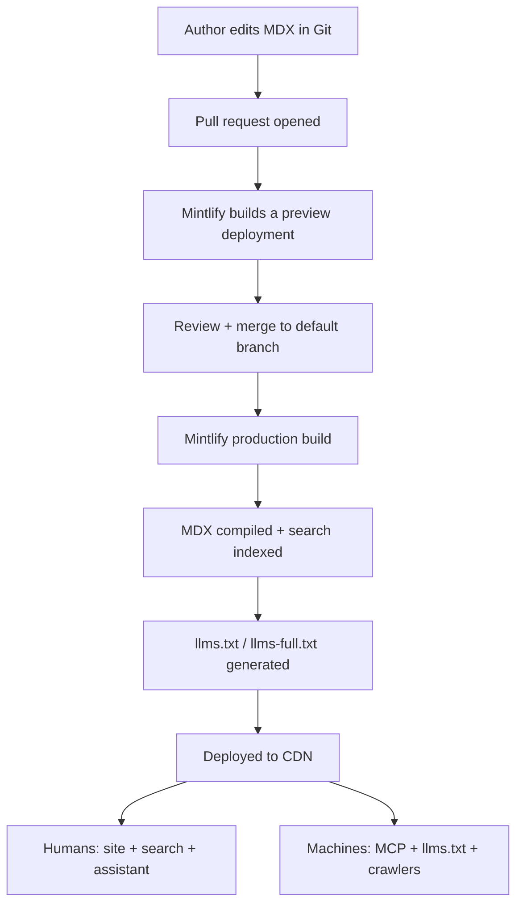

Understanding what happens on `git push` removes most of the "why isn't my change
live?" confusion.

Key implications:

- **Every PR gets a preview URL** — review rendered docs, not raw diffs.
- **Production deploys on merge to the default branch** (typically `main`).
- A **failed build does not deploy** — broken MDX or a malformed `docs.json`
  blocks the release, which is the behavior you want.

<Card title="Next: project structure" icon="arrow-right" href="/feature/mintlify/project-structure">
  How a clean Mintlify repository is laid out.
</Card>
